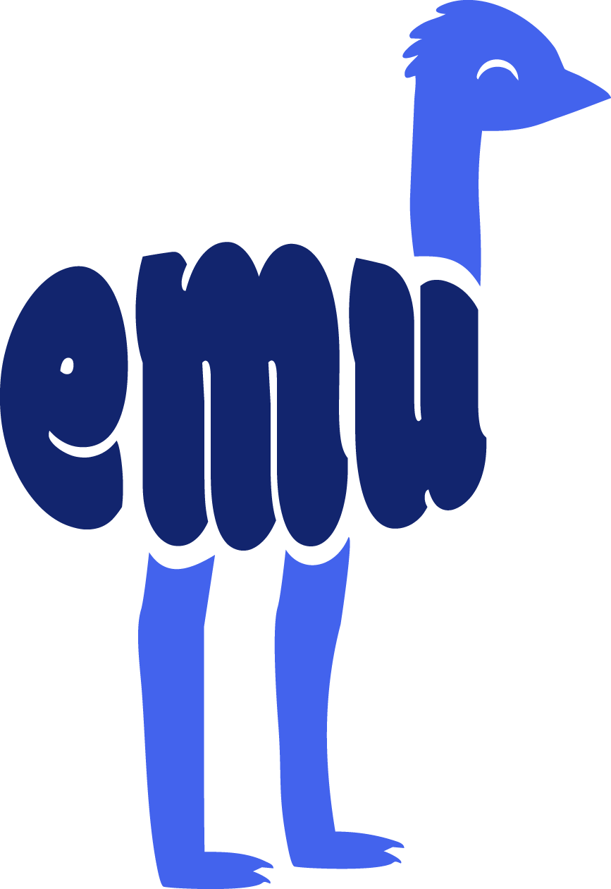
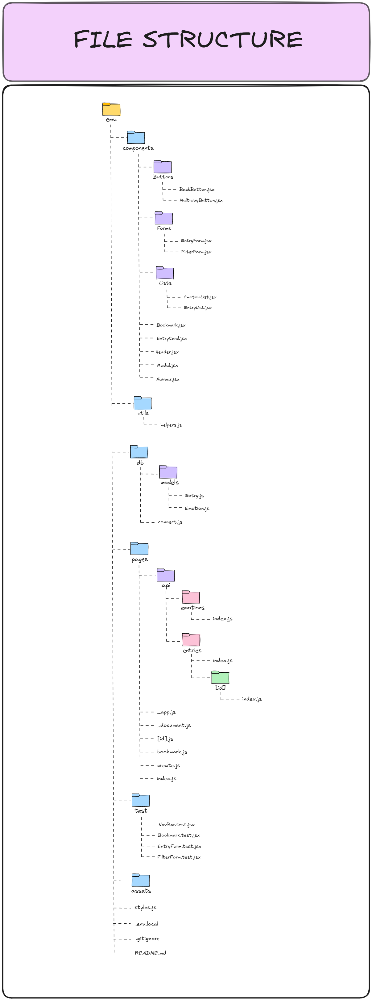
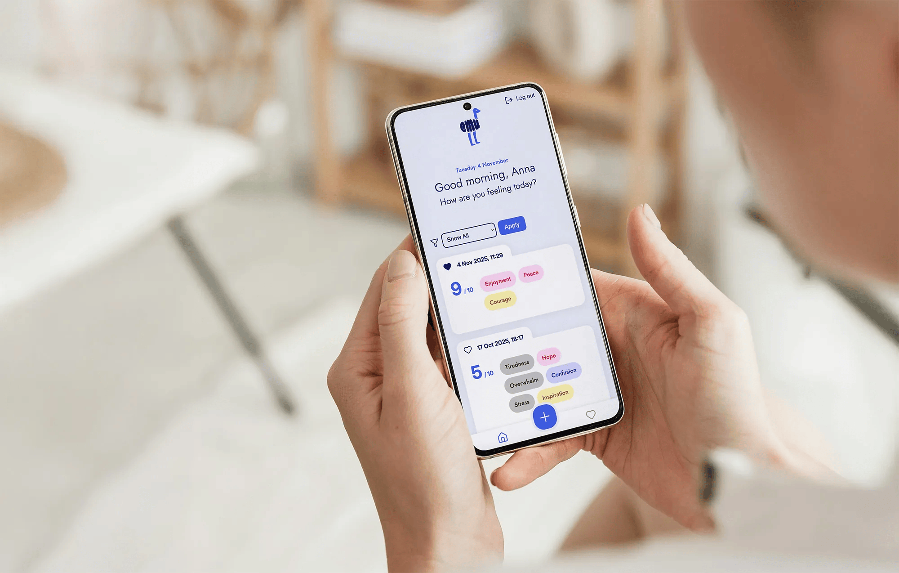
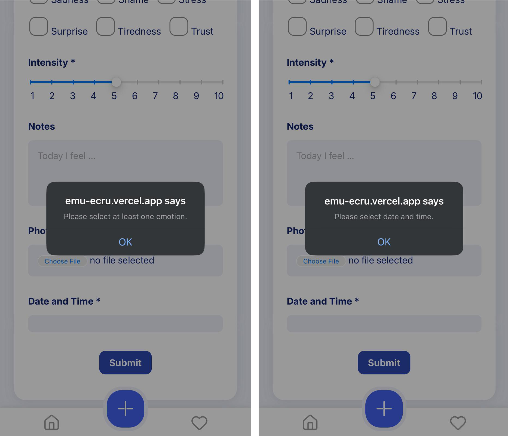

  
[![Contributors][contributors-shield]][contributors-url]
[![Issues][issues-shield]][issues-url]
[![Stargazers][stars-shield]][stars-url]
[![Forks][forks-shield]][forks-url]

[![LinkedIn][linkedin-shield1]][linkedin-url1]
[![LinkedIn][linkedin-shield2]][linkedin-url2]
[![LinkedIn][linkedin-shield3]][linkedin-url3]

 

  

  <h2 align="center">⭐ EMU App ⭐</h2>

  

    A web application to reflect on your daily emotions.
     
    <a href="https://emu-ecru.vercel.app/">View Demo</a>
  

     

  
Table of Contents

  <ol>
    <li><a href="#overview">Overview</a></li>
    <li><a href="#features">Features</a></li>
    <li>
        <a href="#learning-outcomes">Learning Outcomes</a>
        <ul>
        <li><a href="#technical">Technical</a></li>
        <li><a href="#soft-teamwork">Soft Skills & Teamwork</a></li>
        <li><a href="#notes">File Structure</a></li>
      </ul>
    </li>
    <li><a href="#technologies">Technologies</a></li>
    <li><a href="#preview">Preview</a>
      <ul>
        <li><a href="#video-demo">Video Demo</a></li>
        <li><a href="#edge-cases">Edge Cases</a></li>
      </ul>
    </li>
    <li>
      <a href="#contributors">Contributors</a></li>
      <ul>
        <li><a href="#reviewed-by">Reviewed By</a></li>
      </ul>
    <li>
      <a href="#acknowledgments">Acknowledgments</a>
      <ul>
        <li><a href="#special-thanks">Special Thanks</a></li>
        <li><a href="#resources">Resources</a></li>
      </ul>
    </li>
  </ol>

 

<!-- ******************************************************** OVERVIEW ************************************************* -->

<h2 id="overview">🌐 Overview</h2>

The <a href="https://ritakenji.github.io/emu/">EMU App</a> is designed for users to track, analyse, and reflect on their emotional states over time. It facilitates personal emotional awareness and can be used in therapeutic settings or for individual self-reflection.

This application, built by Anna Schemmel, Britta Maier and Rita Macedo, is the final project of the Web-Development bootcamp, also known as Capstone Project. The main goal of this project was to show all the learned skills and technologies taught during the Frontend Web-Development bootcamp at Neuefische.

(<a href="#readme-top">back to top</a>)

<!-- ******************************************************** FEATURES ************************************************* -->

<h2 id="features">🧩 Features</h2>

EMU app is optimized for mobile screen, but because responsive CSS design has been applied, it is possible to view and interact with the app without any issues, from any size of device (mobile, tablet, laptop or desktop).

 

  

 

- Visitor can sign in to the application via GitHub to create their own emotional entries.
- Located on the bottom of the viewport, the Navigation Bar allows the user to intuitively explore the app and locate themselves within it. This feauture is only available after the user has logged in.
- A button to scroll back to top of the page is availabe on homepage and bookmarks page.
- In total, there are 4 main pages the user can visit:

- 🏠 **Home Page**: Browse a well-organised collection of emotion entries.

  - Header greeting text behaves dynamically, according to the time of the day it will greet user with 'Good morning', 'Good afternoon' or 'Good evening'.
  - If not logged in, homepage shows only default entries given as example to visitors. After logging in, default entries are hidden and only personal entries are visible.
  - If user is logged in, header greeting text calls user by their name.
  - The collection is ordered chronologically with the newest entries starting from the top.
  - Each emotion entry shows the date and time it was created on, the emotions felt in that moment and their intensity.
  - Emotion types are visually distinct, using different colours to differentiate them.
  - A heart icon is present on each entry, which makes it possible for the user to toggle the entry's bookmark state.
  - The user can easily filter entries based on an emotion.
  - If collection is empty, user will be prompted to add some via Create Page.

- 📊 **Details Page**: View detailed information on each emotion entry.

  - User is directed to ths page by clickling on a single entry, either on Homepage or Bookmarks page.
  - Each entry details page shows:
    - Date and time (as entry's title)
    - Emotion types
    - Emotion intensity
    - Notes
  - The user has the options to edit or delete the entry.
  - Clicking either option prompts a pop-up window allowing user to make the change (update/delete), as well as cancel the action.

- ➕ **Create Page**: Add new emotion entries, enriching the emotion catalogue.

  - The main feature of this page is the form, with the inputs:
    - Date and time (mandatory)
    - Emotion types (mandatory)
    - Emotion intensity (mandatory)
    - Notes
  - Date and time field is pre-set to show date and time format as DD-MM-YYYY, --:--, but adjustable by the user.
  - The emotions are selected from the existing emotions list via a checkbox.
  - The emotion intensity is selectable on a scale of 1 to 10.
  - User can upload an image from their computer to be shown on the entry.
  - Form submission with any empty mandatory fields is blocked, and clear validation messages indicate the fields that need completion.
  - Upon submission, the new emotion entry is added to the top of the emotion entries list.

- 🔖 **Bookmarks Page**: Save and showcase favourite emotion entries.
  - User can find all bookmarked entries in this page.
  - If there are no bookmarked emotion entries in the bookmarked list, a message is displayed to the user indicating that there are no bookmarks.

(<a href="#readme-top">back to top</a>)

<!-- ******************************************************** LEARNING OUTCOMES ************************************************* -->

<h2 id="learning-outcomes">🧠 Learning Outcomes</h2>
<h3 id="technical">🔩 Technical</h3>

<h4>General</h4>

  - Practicing and implementing the **DRY (Don’t Repeat Yourself) principle** as a refactoring method. We learned to reduce the repetition of code patterns, promoting reusability and maintainability, therefore creating more efficient, readable, and error-free code.
  - Learned to **read, understand and review code of others**, strengthening our problem solving and attention to detail skills.
  - Developed stronger problem solving skills by practicing understanding each tasks’ requirements, discussing potential different approaches, deciding on a final approach and doing **dry runs** before jumping straight to code.
  - Learned how to present and keep our work in structured and understandable ways by using the right terminologies for naming and referring, creating concise file structures and dataflows.
  - Becoming familiarized with the **Agile methodology framework** for project management, specifically the **SCRUM** method.
    
<h4>Frontend and UX/UI</h4>

  - Using correct **HTML semantics** to structure the page and make it more accessible to anyone visiting it.
  - Applying basic **UX/UI principles** (hierarchy, consistency, contrast, etc) to the design of the application to achieve not only aesthetically pleasing, but also excellent accessibility for all users.
  
<h4>React</h4>

  - Mastering the **React component model** to build reusable UI elements, which significantly improved development speed and made the frontend application much easier to maintain.
  - Setting up **dynamic routing** to create clean URLs that automatically load different content (like a unique user profile or product page) based on the address.
  - Effectively **managing application state** using React hooks (like useState and useLocalStorage), ensuring the UI remains reactive and synchronized with underlying data changes across different components.
    
<h4>Next.js</h4>

  - Using the **Next.js framework** to make the app fast by pre-rendering pages (SSR/SSG), and using its simple file structure to manage all the different web addresses (routing).
    
<h4>Testing</h4>

  - Practicing **Test-Driven Development (TDD) and component testing** to catch bugs early, make requirements clearer before writing code, and safely update complex features with confidence.
  - Applying the **principles of The Testing Trophy** to structure our testing strategy, prioritizing highly reliable and quick integration and unit tests over slower end-to-end tests, which led to faster development cycles.
  - Gained clarity on **Testing Classifications** (Unit, Integration, End-to-End, etc.) to ensure we selected the right type of test for validating every specific part and function of the application.
    
<h4>Backend</h4>

  - Designing and building a scalable **backend architecture** on MongoDB, featuring a REST APIs for seamless resource access.
  - Mastering the fundamental **Create, Read, Update, Delete (CRUD) operations** to manage resources efficiently and enable seamless communication between the client and server.
  - Integrated Cloudinary for efficient media management.

(<a href="#readme-top">back to top</a>)

<!--*********** Soft Skills ************-->
<h3 id="soft-teamwork"> 🎭 Skills & Teamwork</h3>

<h4>Interpersonal & Leadership Skills</h4>

- Effectively **working in a team** of three, we established clear roles and leveraged our collective skills to meet project deadlines.

- Maintained a supportive environment through **empathy and active listening** during daily check-ins and code review discussions, ensuring all ideas were genuinely heard and considered before making final decisions.

- Contributed to the team's knowledge base through **proactive teaching and mentoring** sessions, clearly explaining complex technologies and best practices to ensure all members shared the same level of technical understanding.

- Practiced early **talent management** by recognizing individual strengths and delegating tasks strategically, which maximized team efficiency and fostered specialized expertise among members.

<h4>Project & Resource Management</h4>

- Developed strong **resource management** skills by efficiently prioritizing tasks and utilizing project documentation and external libraries to resolve technical roadblocks without extending timelines.

- Ensured high-quality delivery through strong **dependability and attention to detail**, guaranteeing committed tasks were completed on time and rigorously reviewed to meet project standards.

- Mastered **self-organization and clear communication** by consistently documenting individual progress, managing personal workloads, and providing timely, transparent updates on task status to the entire team.

<h4>Adaptability & Innovation</h4>

- Practiced **creative thinking** to rapidly prototype and implement innovative technical solutions for unexpected problems, ensuring the final application features were both functional and optimized.

- Cultivated **resilience, flexibility, and agility** to adapt quickly to last-minute technical pivots or changes in project scope, allowing the team to efficiently reprioritize and keep momentum steady.

- Demonstrated **high motivation and self-awareness** by proactively seeking and applying constructive feedback from teammates, leading to continuous personal and technical improvement throughout the project lifecycle.

(<a href="#readme-top">back to top</a>)

<h3 id="notes">📁 File Structure</h3>

(Project's file structure)

(<a href="#readme-top">back to top</a>)

<!-- ******************************************************** TECHNOLOGIES *************************************************  -->

<h2 id="technologies">💻 Technologies</h2>

    
    
    
    
    
    
    
    
    

✨ HTML ✨ CSS ✨ JavaScript ✨ Node.js ✨ React ✨ Next.js ✨ Jest ✨ MongoDB ✨ Figma ✨

(<a href="#readme-top">back to top</a>)

<!-- ******************************************************** PREVIEW ************************************************* -->
<h2 id="preview">🔍 Preview</h2>

 

(<a href="#readme-top">back to top</a>)

 
 

<h3 id="video-demo">Video Demo</h3>

  

(<a href="#readme-top">back to top</a>)

   
   

<h3 id="edge-cases">Edge Cases</h3>

  
  
(The user will be prompted to fill <b>Emotions</b> and <b>Date and Time</b> form fields in before clicking <b>Submit</b>.)

   

   
  
  
(The error <b>"Failed to load entries"</b> will show when the app is unable to fetch a specific entry.)

  

(<a href="#readme-top">back to top</a>)

<!-- ******************************************************** CONTRIBUTORS ************************************************* -->

<h2 id="contributors">👥 Contributors</h2>

<h3 id="reviewed-by">✅ Reviewed By</h3>

(<a href="#readme-top">back to top</a>)

<!-- ******************************************************** ACKNOWLEDGEMENTS *************************************************
 -->

<h2 id="acknowledgments">🏅 Acknowledgments</h2>

<h3 id="special-thanks">Special Thanks</h3>

As a group we would like to give special thanks to our main coach Gimena, who left the program before we graduated. Thank you for all the knowledge, inspiration, motivation and support you gave us through the bootcamp!

✨ We will keep shining for you ✨

(<a href="#readme-top">back to top</a>)

<h3 id="resources">Resources</h3>

This space lists resources we found helpful in the creation and development of this project, to which we would like to give credit to.

- [Othneildrewb's README template](https://github.com/othneildrew/Best-README-Template#readme)
- [Emoji Cheat Sheet](https://www.webpagefx.com/tools/emoji-cheat-sheet)
- [Shields.io](https://shields.io)
- [Lucide Icons](https://lucide.dev/icons)
- [Icons 8](https://icons8.com/)
- [PageSpeed Insights](https://pagespeed.web.dev/)
- [Web Active Learning Neuefisch](https://web-active-learning.vercel.app/documents/css-responsive)
- [Contrib.rocks](https://contrib.rocks/)
- [Excalidraw](https://excalidraw.com/)
- [VSCode](https://code.visualstudio.com/)
- [Gemni](https://gemini.google.com/app)
- [ChatGPT](https://chatgpt.com)
- [MDN](https://developer.mozilla.org/de/)
- [W3schools](https://www.w3schools.com/)
- [FreeCodeCamp](https://www.freecodecamp.org/learn)
- [Cloudinary](https://cloudinary.com/)
- [NPM packages:](https://www.npmjs.com/)
  - [eslint](https://www.npmjs.com/package/eslint)
  - [lucide-react](https://www.npmjs.com/package/lucide-react)
  - [mongoose](https://www.npmjs.com/package/mongoose)
  - [vercel](https://www.npmjs.com/package/vercel)
  - [cloudinary](https://www.npmjs.com/package/cloudinary)
  - among others

(<a href="#readme-top">back to top</a>)

<!-- MARKDOWN LINKS & IMAGES -->
<!-- https://www.markdownguide.org/basic-syntax/#reference-style-links -->

[contributors-shield]: https://img.shields.io/github/contributors/ritakenji/emu.svg?style=for-the-badge
[contributors-url]: https://github.com/ritakenji/emu/graphs/contributors
[stars-shield]: https://img.shields.io/github/stars/ritakenji/emu.svg?style=for-the-badge
[stars-url]: https://github.com/ritakenji/emu/stargazers
[issues-shield]: https://img.shields.io/github/issues/ritakenji/emu.svg?style=for-the-badge
[issues-url]: https://github.com/ritakenji/emu/issues
[forks-shield]: https://img.shields.io/github/forks/ritakenji/emu.svg?style=for-the-badge
[forks-url]: https://github.com/ritakenji/emu/forks

<!-- Anna's Linkedin Shields -->

[linkedin-shield1]: https://img.shields.io/badge/-Anna's_LinkedIn-black.svg?style=for-the-badge&logo=linkedin&colorB=555
[linkedin-url1]: https://www.linkedin.com/in/anna-lynn-schemmel/

<!-- Britta's Linkedin Shields -->

[linkedin-shield2]: https://img.shields.io/badge/-Britta's_LinkedIn-black.svg?style=for-the-badge&logo=linkedin&colorB=555
[linkedin-url2]: https://www.linkedin.com/in/britta-maier-38a913236/

<!-- Rita's Linkedin Shields -->

[linkedin-shield3]: https://img.shields.io/badge/-Rita's_LinkedIn-black.svg?style=for-the-badge&logo=linkedin&colorB=555
[linkedin-url3]: https://www.linkedin.com/in/rita-macedo-557864103/
