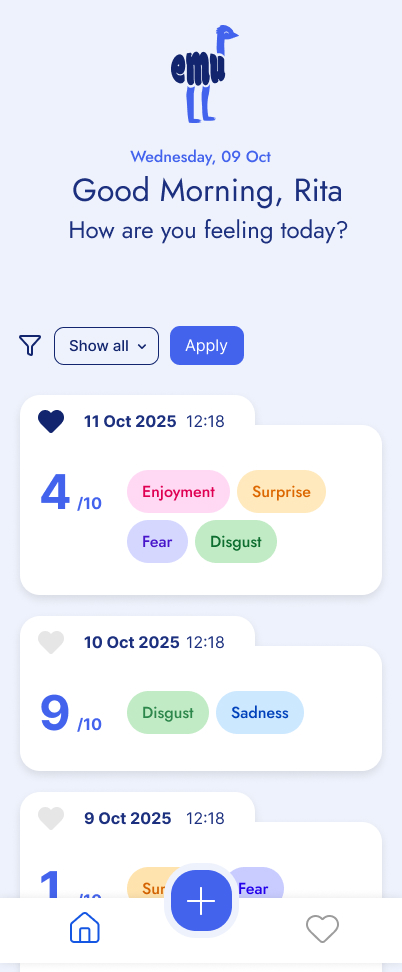

[![Contributors][contributors-shield]][contributors-url]
[![Issues][issues-shield]][issues-url]
[![Stargazers][stars-shield]][stars-url]
[![Forks][forks-shield]][forks-url]
[![LinkedIn][linkedin-shield1]][linkedin-url1]
[![LinkedIn][linkedin-shield2]][linkedin-url2]
[![LinkedIn][linkedin-shield3]][linkedin-url3]

 

  

  <h2 align="center">⭐ EMU App ⭐</h2>

  

    A web application to reflect on your daily emotions.
     
    <a href="https://emu-ecru.vercel.app/">View Demo</a>
  

     

  
Table of Contents

  <ol>
    <li><a href="#overview">Overview</a></li>
    <li><a href="#features">Features</a></li>
    <li>
        <a href="#learning-outcomes">Learning Outcomes</a>
        <ul>
        <li><a href="#notes">Dataflow and File Structure</a></li>
      </ul>
    </li>
    <li><a href="#technologies">Technologies</a></li>
    <li><a href="#preview">Preview</a></li>
    <li>
      <a href="#contributors">Contributors</a></li>
      <ul>
        <li><a href="#reviewed-by">Reviewed By</a></li>
      </ul>
    <li><a href="#acknowledgments">Acknowledgments</a></li>
  </ol>

 

<!-- ******************************************************** OVERVIEW ************************************************* -->

<h2 id="overview">🌐 Overview</h2>

The <a href="https://ritakenji.github.io/emu/">EMU App</a> is designed for users to track, analyse, and reflect on their emotional states over time. It facilitates personal emotional awareness and can be used in therapeutic settings or for individual self-reflection.

This application, built by Anna Schemmel, Britta Maier and Rita Macedo, is the final project of the Web-Development bootcamp, also known as Capstone Project. The main goal of this project was to show all the learned skills and technologies taught during the Frontend Web-Development bootcamp at Neuefische.

(<a href="#readme-top">back to top</a>)

<!-- ******************************************************** FEATURES ************************************************* -->

<h2 id="features">🧩 Features</h2>

EMU app is optimized for mobile screen, but because responsive CSS design has been applied, it is possible to view and interact with the app without any issues, from any size of device (mobile, tablet, laptop or desktop).

 

  

 

- Located on the bottom of the viewport, the Navigation Bar allows the user to intuitively explore the app and locate themselves within it.

- 🏠 **Home Page**: Browse a well-organised collection of emotion entries.

  - The collection is ordered chronologically with the newest entries starting from the top.
  - Each emotion entry shows the date and time it was created on, the emotions felt in that moment and their intensity.
  - Emotion types are visually distinct, using different colours to differentiate them.
  - A heart icon is present on each entry, which makes it possible for the user to toggle the entry's bookmark state.
  - The user can easily filter entries based on an emotion.
  - If collection is empty, user will be prompted to add some via Create Page.

- 📊 **Details Page**: View detailed information on each emotion entry.

  - User is directed to ths page by clickling on a single entry, either on Homepage or Bookmarks page.
  - Each entry details page shows:
    - Date and time (as entry's title)
    - Emotion types
    - Emotion intensity
    - Notes
  - The user has the options to edit or delete the entry.
  - Clicking either option prompts a pop-up window allowing user to make the change (update/delete), as well as cancel the action.

- ➕ **Create Page**: Add new emotion entries, enriching the emotion catalogue.

  - The main feature of this page is the form, with the inputs:
    - Date and time (mandatory)
    - Emotion types (mandatory)
    - Emotion intensity (mandatory)
    - Notes
  - Date and time field is pre-set to show date and time format as DD-MM-YYYY, --:--, but adjustable by the user.
  - The emotions are selected from the existing emotions list via a checkbox.
  - The emotion intensity is selectable on a scale of 1 to 10.
  - Form submission with any empty mandatory fields is blocked, and clear validation messages indicate the fields that need completion.
  - Upon submission, the new emotion entry is added to the top of the emotion entries list.

- 🔖 **Bookmarks Page**: Save and showcase favourite emotion entries.
  - User can find all bookmarked entries in this page.
  - If there are no bookmarked emotion entries in the bookmarked list, a message is displayed to the user indicating that there are no bookmarks.

(<a href="#readme-top">back to top</a>)

<!-- ******************************************************** LEARNING OUTCOMES ************************************************* -->

<h2 id="learning-outcomes">🧠 Learning Outcomes</h2>

- Using correct **HTML semantics** to structure the page and make it more accessible to anyone visiting it;
- ...Agile Workflow -> SCRUM
- ...TDD/Component testing --> x % code coverage
- ...Backend
- ...API and CRUD
- ...React Dynamic routes
- ...React
- ...UX/UI principles
- ...React State

<h3 id="notes">📁 Dataflow and File Structure</h3>

[insert excalidraws here]

(<a href="#readme-top">back to top</a>)

<!-- ******************************************************** TECHNOLOGIES *************************************************  -->

<h2 id="technologies">💻 Technologies</h2>

    
    
    
    
    
    
    
    

✨ HTML ✨ CSS ✨ JavaScript ✨ Node.js ✨ React ✨ Next.js ✨ Jest ✨ MongoDB ✨

(<a href="#readme-top">back to top</a>)

<!-- ******************************************************** PREVIEW ************************************************* -->
<h2 id="preview">🔍 Preview</h2>

[Insert screenshots or a GIF of your application in action, this should include not just the "happy path" but edge cases as well (what happens when there's an error? Etc). Remember to add clear titles for each image.]

(<a href="#readme-top">back to top</a>)

<!-- ******************************************************** CONTRIBUTORS ************************************************* -->

<h2 id="contributors">👥 Contributors</h2>

<h3 id="reviewed-by">✅ Reviewed By</h3>

(<a href="#readme-top">back to top</a>)

<!-- ******************************************************** ACKNOWLEDGEMENTS *************************************************
 -->

<h2 id="acknowledgments">🏅 Acknowledgments</h2>

This space lists resources we found helpful in the creation and development of this project, to which we would like to give credit to.

- [Othneildrewb's README template](https://github.com/othneildrew/Best-README-Template#readme)
- [Emoji Cheat Sheet](https://www.webpagefx.com/tools/emoji-cheat-sheet)
- [Img Shields](https://shields.io)
- [Lucide Icons](https://lucide.dev/icons)
- [Icons 8](https://icons8.com/)
- [PageSpeed Insights](https://pagespeed.web.dev/)
- [Web Active Learning Neuefisch](https://web-active-learning.vercel.app/documents/css-responsive)
- [Contrib.rocks](https://contrib.rocks/)

(<a href="#readme-top">back to top</a>)

<!-- MARKDOWN LINKS & IMAGES -->
<!-- https://www.markdownguide.org/basic-syntax/#reference-style-links -->

[contributors-shield]: https://img.shields.io/github/contributors/ritakenji/emu.svg?style=for-the-badge
[contributors-url]: https://github.com/ritakenji/emu/graphs/contributors
[stars-shield]: https://img.shields.io/github/stars/ritakenji/emu.svg?style=for-the-badge
[stars-url]: https://github.com/ritakenji/emu/stargazers
[issues-shield]: https://img.shields.io/github/issues/ritakenji/emu.svg?style=for-the-badge
[issues-url]: https://github.com/ritakenji/emu/issues
[forks-shield]: https://img.shields.io/github/forks/ritakenji/emu.svg?style=for-the-badge
[forks-url]: https://github.com/ritakenji/emu/forks

<!-- Anna's Linkedin Shields -->

[linkedin-shield1]: https://img.shields.io/badge/-Anna's_LinkedIn-black.svg?style=for-the-badge&logo=linkedin&colorB=555
[linkedin-url1]: https://www.linkedin.com/in/anna-lynn-schemmel/

<!-- Britta's Linkedin Shields -->

[linkedin-shield2]: https://img.shields.io/badge/-Britta's_LinkedIn-black.svg?style=for-the-badge&logo=linkedin&colorB=555
[linkedin-url2]: https://www.linkedin.com/in/britta-maier-38a913236/

<!-- Rita's Linkedin Shields -->

[linkedin-shield3]: https://img.shields.io/badge/-Rita's_LinkedIn-black.svg?style=for-the-badge&logo=linkedin&colorB=555
[linkedin-url3]: https://www.linkedin.com/in/rita-macedo-557864103/
